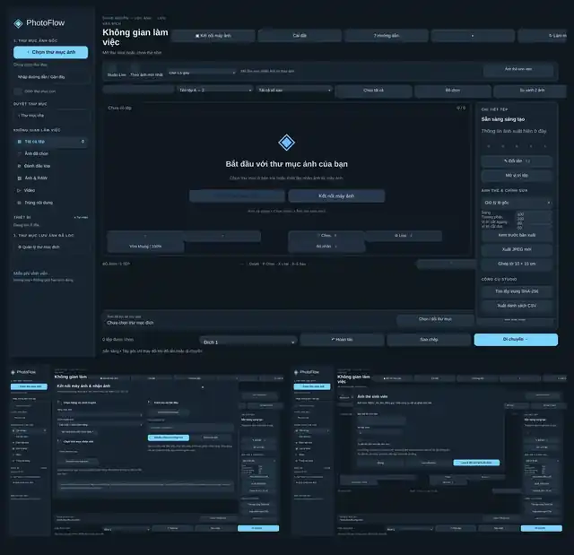

<div align="center">


# 📸 PhotoFlow Studio

### Workflow ảnh & video desktop dành cho Windows

**Chọn ảnh • Phân loại • Đổi tên • Studio Live • Ảnh thẻ • Chỉnh sửa • Copy/Move an toàn • Xuất CSV**

[🌐 **Website chính thức**](https://photoflowstudio.pages.dev/) · [⭐ **GitHub Repository**](https://github.com/trietpko2002/PhotoFlow-Studio) · [📖 **Tài liệu đầy đủ**](./docs/README-6.0-full.md)

[](https://photoflowstudio.pages.dev/)
[](https://github.com/trietpko2002/PhotoFlow-Studio)


**Miễn phí • Hoạt động offline • Không key kích hoạt • Không thuê bao**

</div>

---

## 🖼️ Giao diện thực tế

<div align="center">

<a href="https://photoflowstudio.pages.dev/">
  
</a>

**Bấm vào ảnh để mở website PhotoFlow Studio.**

[🌐 Xem trang chủ](https://photoflowstudio.pages.dev/) · [🔎 Xem source trên GitHub](https://github.com/trietpko2002/PhotoFlow-Studio)

</div>

Ảnh trên được dựng từ chính giao diện PhotoFlow Studio, gồm:

- **Không gian làm việc** — duyệt, preview, chọn, phân loại và xử lý ảnh/video.
- **Kết nối máy ảnh** — hướng dẫn nhận ảnh qua USB/phần mềm hãng, Wi‑Fi/LAN hoặc thư mục nhận ảnh.
- **Ảnh thẻ sinh viên** — nhập mã sinh viên, họ tên, số thứ tự và tự động hóa quy trình đổi tên.

---

## ✨ Điểm nổi bật

- Duyệt và preview ảnh/video trong một workspace thống nhất.
- Chọn nhiều file bằng `Ctrl` / `Shift`.
- Gắn nhãn, chấm sao, tìm kiếm và lọc nhanh.
- Studio Live theo dõi ảnh mới trong thư mục nhận ảnh.
- Workflow ảnh thẻ sinh viên và đổi tên tự động.
- Cắt ảnh 2×3, 3×4, 4×6 và ghép tờ 10×15 cm.
- Điều chỉnh sáng, tương phản và vị trí khung cắt.
- So sánh hai ảnh.
- Tìm file trùng nội dung bằng SHA‑256.
- Tối đa 10 thư mục đích.
- Copy / Move theo quy trình **COPY → VERIFY → DELETE**.
- Hoàn tác thao tác file gần nhất.
- Xuất danh sách CSV UTF‑8.
- Light Mode / Dark Mode.
- Hoạt động offline sau khi cài đặt.

---

## 🚀 Quy trình nhanh

```text
Mở thư mục ảnh
      ↓
Preview & chọn ảnh
      ↓
Gắn nhãn / chấm sao / đổi tên
      ↓
Chỉnh ảnh / ảnh thẻ / Studio Live
      ↓
Chọn thư mục đích
      ↓
Copy hoặc Move
      ↓
Verify dữ liệu
```

---

## 📦 Cài đặt

### Dùng bản phát hành

1. Mở mục **Releases** của repository.
2. Tải bản Windows phù hợp.
3. Nếu là ZIP, giải nén toàn bộ.
4. Chạy `PhotoFlow Studio.exe`.

> Không tách riêng file `.exe` khỏi các thư mục `resources`, `locales` và DLL đi kèm.

### Chạy từ source

Yêu cầu Node.js, sau đó:

```bash
npm ci
npm start
```

Build Windows:

```bash
npm run dist:win
```

---

## ⌨️ Phím tắt chính

| Phím | Chức năng |
|---|---|
| `P` | Chọn ảnh |
| `X` | Đánh dấu loại |
| `U` | Bỏ nhãn |
| `0–5` | Chấm sao |
| `F2` | Đổi tên |
| `Ctrl + Click` | Chọn nhiều file rời |
| `Shift + Click` | Chọn một dải file |
| `Ctrl + Z` | Hoàn tác thao tác file gần nhất |

---

## 🔐 An toàn dữ liệu

PhotoFlow Studio ưu tiên hạn chế ghi đè và mất dữ liệu ngoài ý muốn:

- Kiểm tra SHA‑256 và metadata khi di chuyển file.
- Không tự ghi đè khi tên đích đã tồn tại.
- Chỉ xóa nguồn sau khi bản sao đã được kiểm tra.
- Renderer Electron không bật Node.js trực tiếp; sử dụng `contextIsolation`, CSP và IPC giới hạn.

> Với dữ liệu quan trọng, vẫn nên duy trì ít nhất một bản backup độc lập.

---

## 🔗 Liên kết chính thức

| Kênh | Liên kết |
|---|---|
| 🌐 Website | [photoflowstudio.pages.dev](https://photoflowstudio.pages.dev/) |
| 💻 GitHub | [trietpko2002/PhotoFlow-Studio](https://github.com/trietpko2002/PhotoFlow-Studio) |
| 👤 Tác giả | [@trietpko2002](https://github.com/trietpko2002) |
| 📖 Tài liệu 6.0 đầy đủ | [docs/README-6.0-full.md](./docs/README-6.0-full.md) |

Website và repository liên kết qua lại để người dùng có thể kiểm tra nguồn dự án, lịch sử thay đổi và thông tin phát hành từ cùng một nơi.

---

## 🎬 Demo

[▶️ Xem video Demo](https://www.youtube.com/watch?v=fv0oM1BhCiI)

---

## ⭐ Support Project

Nếu PhotoFlow Studio hữu ích với bạn:

- ⭐ Star repository.
- 🐛 Báo lỗi khi gặp bug.
- 💡 Gửi góp ý tính năng.
- 📣 Chia sẻ project cho người cần workflow lọc và xử lý ảnh.

---

<div align="center">

### PhotoFlow Studio

**From a simple photo filter tool → to a complete desktop photo workflow.**

Made by [@trietpko2002](https://github.com/trietpko2002)

[🌐 Website](https://photoflowstudio.pages.dev/) · [💻 GitHub](https://github.com/trietpko2002/PhotoFlow-Studio)

</div>
